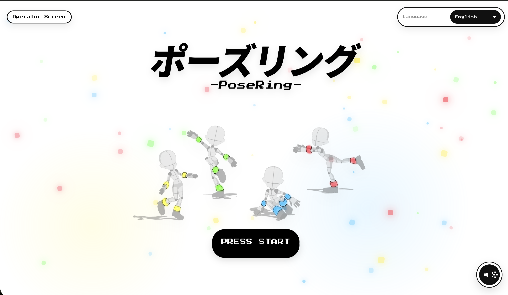

# Wearable Device Game

研究室の6週間制作プロジェクトで制作した、装着型デバイスを用いた体験型ゲームです。  
ユーザーは手足に装着したデバイスの光を手がかりに、出題されたポーズへ近づきます。

## Screenshot

Webアプリのタイトル画面です。なお、タイトル画面のUIデザインおよびビジュアル制作は、チーム内の別メンバーが担当しました。

## Demo

- [ポーズ出題者デモ動画](https://drive.google.com/file/d/1Xqc0f_wxPFXWYXqj-msFz2J5nz2OahM3/view?usp=drive_link)
  出題者側のデモ動画です。正解ポーズを設定する様子を示しています。

- [ポーズ回答者デモ動画](https://drive.google.com/file/d/1-SlCL6KXHPiziBa0QmUX0Zh4I-O0hYVJ/view?usp=drive_link)  
  回答者側のデモ動画です。装着型デバイスの光を手がかりに、出題ポーズへ近づく様子を示しています。

## Source Code

- [`src/pose_ring_mainPC_controller.py`](src/pose_ring_mainPC_controller.py)

装着型デバイスゲームのメインPC側で動作する制御プログラムです。  
本システムでは、手足に色付きの手袋・靴下を装着し、色の違いによって各部位を識別しました。  
正面方向のAセットカメラ2台を基本に、手足が正面から見えない場合を補うため、Bセットカメラ2台を補助的に用いました。  
このプログラムでは、Aセットで検出した座標を優先し、Aセットで検出できない色についてはサブPCから受信したBセットの3D座標を利用します。  
現在座標と目標座標を比較し、目標との距離に応じて、手足に装着したデバイス内のXIAOへBLE通信でLEDフィードバックを送信します。

## Technologies

- Python
- OpenCV
- Webカメラ
- 三角測量
- UDP通信
- BLE通信
- XIAO
- 基板加工
- 回路制作

## My Role

- プロジェクトマネージャーとして実現方法の整理と進捗管理
- 座標取得方法の検討
- 2台のWebカメラによる三角測量案の提案
- デバイス制作、基板加工、回路制作の一部

## Notes

- Webアプリ、マイコン書き込み用コード、Bカメラ側の座標推定コード、キャリブレーション用コードはチームメンバーが担当したため、本リポジトリには掲載していません。
- キャリブレーション画像およびキャリブレーション結果ファイルは、カメラ配置や実行環境に依存するため、本リポジトリには掲載していません。

